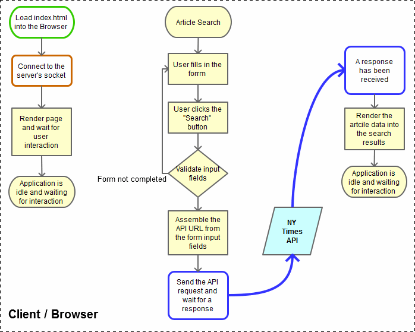
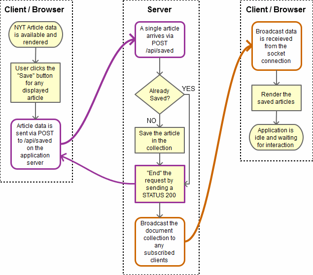
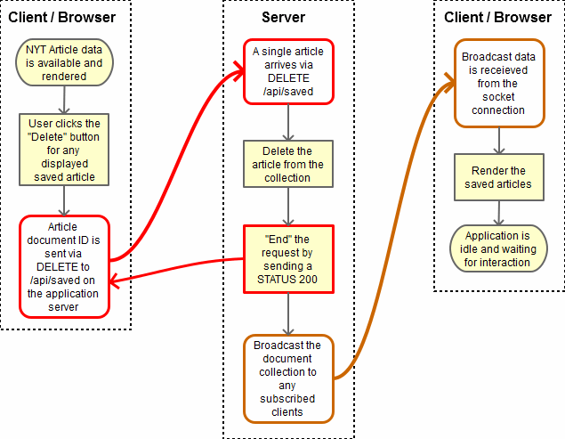

# NYT React Search

A React-based rendition of the New York Times Article Search application Created as an exercise for week 19 homework.

* [Overview](#overview)
* [Usage](#usage)
  * [Running from Heroku](#running-from-heroku)
    * [URLs](#urls)
  * [Browser Differences](#browser_differences)
* [Application Architecture Overview](#application-architecture-overview)
  * [React Components](#react-components)
* [Application Flow Overviews](#application-flow-overviews)
  * [Initial page load and API data retrieval](#initial-page-load-and-api-data-retrieval)
  * [Save an Article](#save-n-article)
  * [Delete an Article](#delete-n-article)

# Overview

This application was developed as a homework assignment that I had in a *Full Stack Developer* class.

The primary purpose of the assignment was to demonstrate - 

* React - Create components containing various HTML elements including forms, buttons, and styling. 
* Express Server - Configured with file paths and API paths.
* MongoDB / Mongoose - API endpoints save and delete documents in the *saved article* collection.
* Socket.io - The client side of the application connects to a socket and received data updates after POST or DELETE

# Usage

This application has been deployed to Heroku as per the assignment, but it can also be ran locally.

## Running from Heroku

At the time when this assignment was submitted the application has been deployed to Heroku. Its URL is - 

    Heroku link is provided in the homework submission
    
*NOTE: The `:3000` port selection is not necessary, there is a `PORT` environment variable that contains the port number to be used.*

### URLs

The following URLs are recognized by the server and will serve pages - 

* `https://deployed-server/` - displays the *index* page
* `https://deployed-server/index` - displays the *index* page

No other paths are intended for direct access via the browser.

## Browser Differences

The obvious difference between browsers (_Firefox, Chrome, and IE_) is seen in regards to the HTML5 date picker that replaced the text input fields in the search panel. 

The following browsers were up to date at the time this was noticed :
* **Firefox 54.0.1 (64-bit)** - A _text input_ field. The **End Date** is filled in with the current date, but no picker controls are present.
* **Microsoft Edge 38.14393.1066.0** - Displays a _date picker_, but it's not very clean looking. 
* **Microsoft Internet Explorer 11.1480.14393.0** - Behaves just like Firefox.
* **Chrome 59.0.3071.115 (Official Build) (64-bit)** - Works perfectly, as expected. 

# Application Architecture Overview

The following diagram illustrates the relationships between the browser, server system, and data flow.

  

## React Components

The following page components are contained withing `app.js` - 

  

# Application Flow Overviews

The following diagrams describe the application's program flow in regards to - 

* Initial page load and API data retrieval
* Save an article
* Delete an article

## Initial Page Load and API Data Retrieval

  

## Save an Article

  

## Delete an Article

  

---

